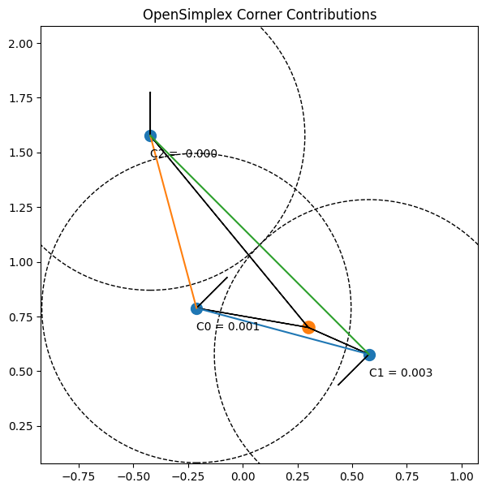
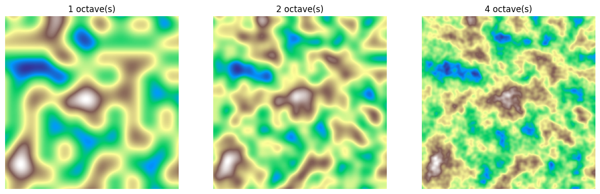
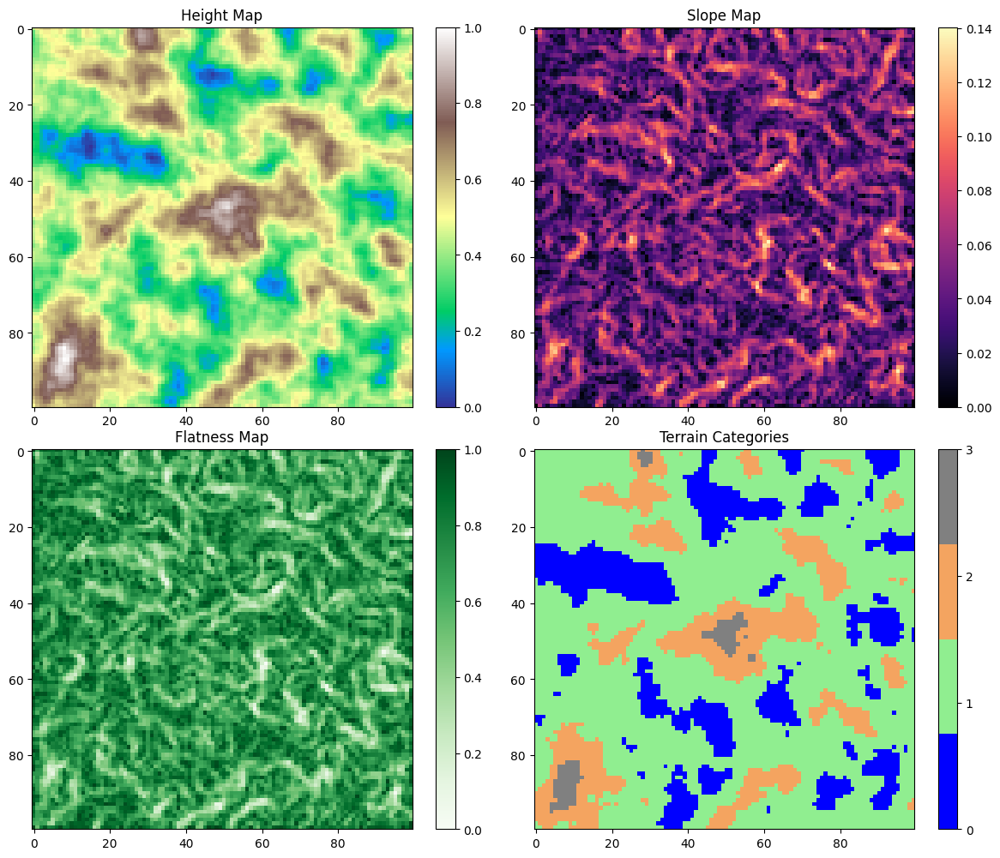
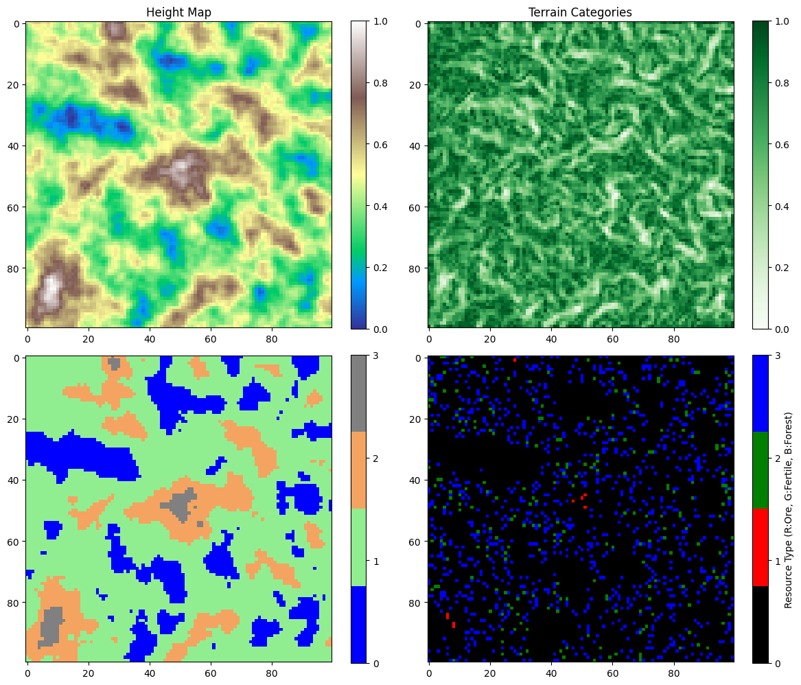

# Description:
this is a Random terrain generation and swarm intelligence optimisation project visualisation project using javaFX.

For now the implimentation is 2D;

# People:
@mokhatiri
@lamseey

# Project Steps:


the project can be divided into multiple steps:

---
# 1. Terrain:

-the terrain is generated using noise map ( terrain/ Noise.java , NoiseMapGenerator.java )
this is done using OpenSimplex Noise (for now)


## Simplex noise:

the main difference between perlin, and simplex noise is that perlin uses interpolation, simplex does summation, that's why, simplex has a complexity of O(n^2), while perlin is O(2^n) complex. Also perlin uses a grid, but simplex uses simplexes, in 2d that's a triangle, 3d that's a tetrahedron, ..etc.

Simplex noise uses a direct summation from the corners's contributions of the simplex; where the contribution is a multiplication of the extrapolation of the gradient ramp and a radially symmetric attenuation function.

`- Contribution=(gradient ramp)×(attenuation)`

At each corner of the simplex:
    A random gradient vector is assigned.
    The algorithm computes how aligned the point is with that vector, using:
    ` ramp= gradient_corner ⋅(x_current − x_corner​) `

And the attenuation function is basically the "fade-out" factor:
we are using something like:
 - `t=(radius^2−distance^2)`
 - `attenuation = t^4`

so basically:
```
noise = sum[corners] (g.d).t^4
```

while simplex is not openSource, because it has a patent.
But:
OpenSimplex is very similar to Simplex noise in structure and math, but it was created as a patent-free alternative with lower directional artifacts.

### Difference:

1. Open Simplex uses a Different lattice, it uses a different skewing matrix that produces a slightly different simplex tiling of space. (but still based on simplex-like shapes)

2. 
```
 noise = sum[corners] attenuation(d).(gradient.d) 
```

### for 2D:

the skew matrices are:

2D skew : 
```
s=(x+y)⋅α
i=⌊x+s⌋, j=⌊y+s⌋
```

2D unskew:
```
t=(i+j)⋅β
X0​=i−t, Y0​=j−t
x0​=x−X0​, y0​=y−Y
```

where:
α = (1/√3 - 1)/2
β = (3 - √3)/6

(here alpha and beta, are just standard, you can choose otherwise if you want.)

---
now how do you know what simplex are you in ?

each lattice cell looks like this:


```

if x0 > y0:
    i1 = 1; j1 = 0 # lower-right triangle
else:
    i1 = 0; j1 = 1 # upper-left triangle

```
( basically :) )

--- 
next we compute the contributions from the 3 corners.

1. compute displacement vector:
```
xn​=x0​−Δxn​, yn​=y0​−Δyn​

basically:

d_vector = (x_point − x_corner, y_point − y_corner)
```
2. compute attenuation:

```
t = 0.5 - x_n^2 - y_n^2
```
3. if t < 0: contribution = 0.
4. otherwise:
    - pick gradient vector for that corner.
    - compute ramp: `ramp = g_x.n_x + g_y.n_y`
    - multiply with attenutation: ` contrib = (t^4) . ramp `

### example:


---
now unlike perlin/simplex random grandient choices, opensimplex uses a special set of gradients to reduce directional artifacts:

there are 256 or 512 gradient entries;

The gradients are chosen so the distribution is isotropic (even).
`index=perm[i+perm[j]]`
perm is a randomiser (i -> random(0-256/512)(i)).

then: 
```
gx, gy = gradients2D[index % len(gradients2D)]
```

---

so the algorithm becomes:

```
noise2D(x, y):
    # Skew the input
    s = (x + y) * alpha
    i = floor(x + s)
    j = floor(y + s)

    # Unskew the cell origin
    t = (i + j) * beta
    X0 = i - t
    Y0 = j - t
    x0 = x - X0
    y0 = y - Y0

    # Choose triangle
    if x0 > y0:
        i1 = 1; j1 = 0   # lower triangle
    else:
        i1 = 0; j1 = 1   # upper triangle

    # Corner positions relative to input
    x1 = x0 - i1 + beta
    y1 = y0 - j1 + beta
    x2 = x0 - 1 + 2*beta
    y2 = y0 - 1 + 2*beta

    # Get gradient indices from permutations
    gi0 = perm[i + perm[j]]
    gi1 = perm[i + i1 + perm[j + j1]]
    gi2 = perm[i + 1 + perm[j + 1]]

    # Compute corner contributions
    contrib0 = atten_dot(x0, y0, gi0)
    contrib1 = atten_dot(x1, y1, gi1)
    contrib2 = atten_dot(x2, y2, gi2)

    return 70 * (contrib0 + contrib1 + contrib2)

atten_dot(x, y, gi):
    t = 0.5 - x*x - y*y
    if t < 0: return 0
    t4 = t*t*t*t
    gx, gy = gradient[gi]
    return t4 * (gx*x + gy*y)
```

this is the original OpenSimplex,
but later versions exist:

let me introduce OpenSimplex2:

## OpenSimplex2:

the main difference between this and what we already mentioned is that:

### 1. different skew/unskew constants:

```
private static final double STRETCH_CONSTANT = -0.211324865405187; // (1/√2 - 1)/2
private static final double SQUISH_CONSTANT = 0.366025403784439;  // (√2 - 1)/2
```

### 2. OpenSimplex2 uses a carefully chosen set of 12 gradients in 2D for better isotropy.


we are using:
```
private static final double[] gradients2D = new double[] {
    5,  2,  2,  5,
    -5,  2, -2,  5,
    5, -2,  2, -5,
    -5, -2, -2, -5,
};
```

so finally the code becomes:
[Noise.java](./src/main/java/terrain/Noise.java)

## Generate the noise map:

### step 1: Generate the base noise: done 
### step 2: apply octaves:

Realistic terrain isn’t just smooth hills; it has layers of detail.
Each octave is another layer of noise added to the base:
```
total_noise = octave1 + octave2 + octave3 + ...
```
For each octave:
- Increase frequency: the features get smaller (finer details) → controlled by lacunarity.
- Decrease amplitude: the new layer contributes less to overall height → controlled by persistence.

so basically:
```
noiseHeight = 0;
for (int o = 0; o < octaves; o++) {
    sampleX = x / scale * frequency;
    sampleY = y / scale * frequency;
    noiseHeight += noise.eval(sampleX, sampleY) * amplitude;

    amplitude *= persistence;
    frequency *= lacunarity;
}
```

### step 3: normalise
After summing octaves, noiseHeight may go outside [0,1].
Normalize to [0,1]:
```
normalized = (noiseHeight + 1) / 2.0;
```



check the code in [NoiseMapGenerator.java](/src/main/java/terrain/NoiseMapGenerator.java)

## Analyse the terrain:

### 1. Slope:

the slope can be simply determined using :
#### $ slope = \sqrt{x^2+y^2}  $

where dx = $ (height[x + 1][y] - height[x - 1][y])/2 $
... and dy = $ (height[x][y + 1] - height[x][y - 1])/2 $

### 2. flatness:

#### $ flatness = 1 - (slope / maxSlope)$

### 3. Terrain Categorisation:

this can be done using predefined base heights:

in our case we are using:
```
if (h < waterLevel){
    terrain[x][y] = 0; // water
}
else if (h < hillLevel){
    terrain[x][y] = 1; // plains
}
else if (h < mountainLevel){
    terrain[x][y] = 2; // hill
}
else{
    terrain[x][y] = 3; // mountain
}
```



check it in: [TerrainAnalyser.java](./src/main/java/terrain/TerrainAnalyzer.java)


## Randomly attribute Natural Ressources:

this can be done using the informations we got from TerrainAnalyser, and a probability score, that gives the possibility of a placement to be a certain ressource.



check out: [NaturalResourceRandomizer.java](./src/main/java/terrain/NaturalResourceRandomizer.java)


# 2. Swarm:

