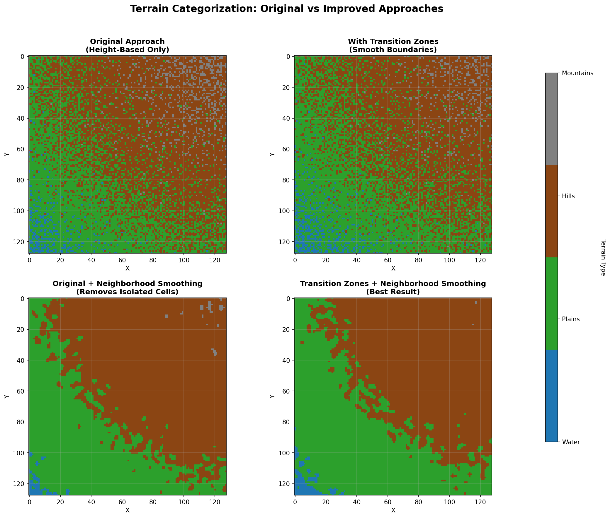
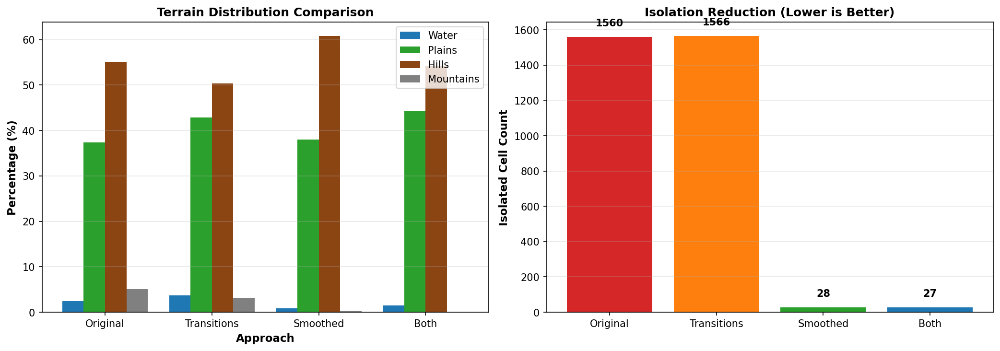
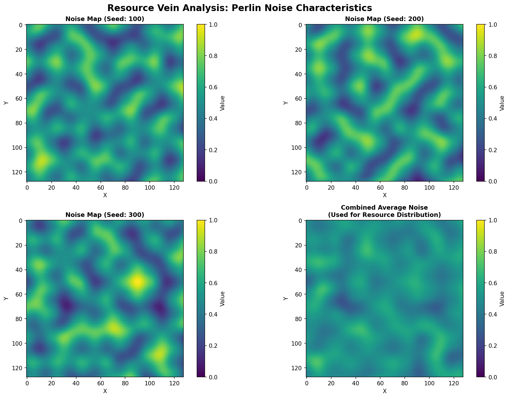
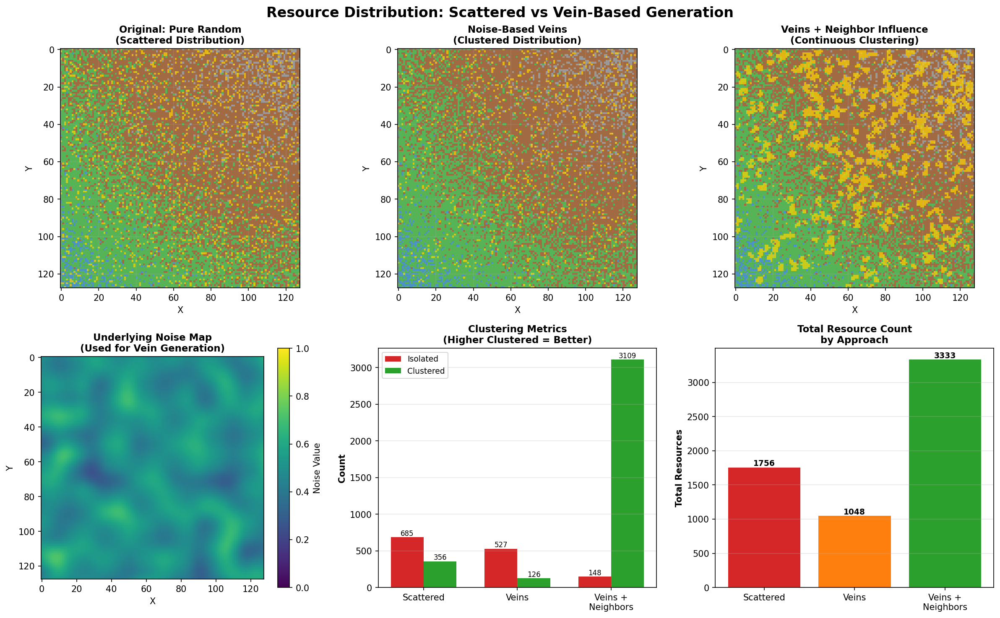

# Description:
this is a Random terrain generation and swarm intelligence optimisation project visualisation project using javaFX.

For now the implimentation is 2D;

## Visualization (JavaFX)

This project uses JavaFX to present interactive previews for terrain/noise generation and PSO visualization. The `app.Launcher` opens a simple interface to explore the 2D previews and tweak parameters in real time via the controls. Use the `NoisePreview2D` and `PSOPreview` views for quick visual exploration.

Run the application (Windows example):
```pwsh
mvn javafx:run -Djavafx.platform=win
```

# People:
@mokhatiri
@lamseey

# Project Steps:


## n-Dimensional (ND) generalization

To make the core components more flexible and future-proof, the project includes lightweight n-dimensional array wrappers and ND-capable variations of key algorithms. The 2D view and behaviour are kept backward-compatible.

- New utility types:
    - `DoubleNDArray` and `IntNDArray` — flat-backed ND containers with `from2D(...)`, `from3D(...)` factories and general `get`/`set`.
    - `PositionMapper` — converts continuous PSO positions into discrete ND coordinates.

- ND-enabled algorithmic changes:
    - `TerrainAnalyzer(DoubleNDArray)` supports `computeSlopeND()` and `categorizeTerrainND(...)` with neighborhood voting.
    - `NaturalResourceRandomizer` now exposes `randomizeResourceWeightedND(IntNDArray terrain, DoubleNDArray flatness, double[] baseProbabilities)` that returns an `IntNDArray` whose last axis contains resource presence flags.
    - Fitness functions (`ResourceFitness`, `TerrainFitness`) implement `evaluate(int[] coords)` to operate on ND coordinates.
    - `ResourcePlacementSolution` now stores `int[] coords` for ND placement.

Snippet examples:

```java
// build an ND heightmap from a 2D array
DoubleNDArray heightND = DoubleNDArray.from2D(heightMap);
TerrainAnalyzer analyzerND = new TerrainAnalyzer(heightND);
DoubleNDArray slopeND = analyzerND.computeSlopeND();
IntNDArray terrainND = analyzerND.categorizeTerrainND(waterLevel, hillLevel, mountainLevel, transition);

// generate ND resource placement
NaturalResourceRandomizer rr = new NaturalResourceRandomizer(seed, width, height, scale, offsetX, offsetY);
IntNDArray resourceND = rr.randomizeResourceWeightedND(terrainND, slopeND, params.getProbabilitiesArray());

// use swarm optimizer with ND-aware discrete fitness via an adapter
int[] gridShape = new int[]{width, height};
ResourceFitness rFitness = new ResourceFitness(flatness2D, flatnessCoeff, resourceTerrain3D, /*values...*/);
TerrainFitness tFitness = new TerrainFitness(flatness2D, flatnessCoeff, terrain2D, /*values...*/);
SwarmOptimizer optimizer = new SwarmOptimizer(dimensions, w, c1, c2, resourceCoeff, terrainCoeff, rFitness, tFitness, gridShape);
```

---
# 1. Terrain:

-the terrain is generated using noise map ( terrain/ Noise.java , NoiseMapGenerator.java )
this is done using OpenSimplex Noise (for now)


## Simplex noise:

the main difference between perlin, and simplex noise is that perlin uses interpolation, simplex does summation, that's why, simplex has a complexity of O(n^2), while perlin is O(2^n) complex. Also perlin uses a grid, but simplex uses simplexes, in 2d that's a triangle, 3d that's a tetrahedron, ..etc.

Simplex noise uses a direct summation from the corners's contributions of the simplex; where the contribution is a multiplication of the extrapolation of the gradient ramp and a radially symmetric attenuation function.

`- Contribution=(gradient ramp)×(attenuation)`

At each corner of the simplex:
    A random gradient vector is assigned.
    The algorithm computes how aligned the point is with that vector, using:
    ` ramp= gradient_corner ⋅(x_current − x_corner​) `

And the attenuation function is basically the "fade-out" factor:
we are using something like:
 - `t=(radius^2−distance^2)`
 - `attenuation = t^4`

so basically:
```
noise = sum[corners] (g.d).t^4
```

while simplex is not openSource, because it has a patent.
But:
OpenSimplex is very similar to Simplex noise in structure and math, but it was created as a patent-free alternative with lower directional artifacts.

### Difference:

1. Open Simplex uses a Different lattice, it uses a different skewing matrix that produces a slightly different simplex tiling of space. (but still based on simplex-like shapes)

2. 
```
 noise = sum[corners] attenuation(d).(gradient.d) 
```

### for 2D:

the skew matrices are:

2D skew : 
```
s=(x+y)⋅α
i=⌊x+s⌋, j=⌊y+s⌋
```

2D unskew:
```
t=(i+j)⋅β
X0​=i−t, Y0​=j−t
x0​=x−X0​, y0​=y−Y
```

where:
α = (1/√3 - 1)/2
β = (3 - √3)/6

(here alpha and beta, are just standard, you can choose otherwise if you want.)

---
now how do you know what simplex are you in ?

each lattice cell looks like this:


```

if x0 > y0:
    i1 = 1; j1 = 0 # lower-right triangle
else:
    i1 = 0; j1 = 1 # upper-left triangle

```
( basically :) )

--- 
next we compute the contributions from the 3 corners.

1. compute displacement vector:
```
xn​=x0​−Δxn​, yn​=y0​−Δyn​

basically:

d_vector = (x_point − x_corner, y_point − y_corner)
```
2. compute attenuation:

```
t = 0.5 - x_n^2 - y_n^2
```
3. if t < 0: contribution = 0.
4. otherwise:
    - pick gradient vector for that corner.
    - compute ramp: `ramp = g_x.n_x + g_y.n_y`
    - multiply with attenutation: ` contrib = (t^4) . ramp `

### example:


---
now unlike perlin/simplex random grandient choices, opensimplex uses a special set of gradients to reduce directional artifacts:

there are 256 or 512 gradient entries;

The gradients are chosen so the distribution is isotropic (even).
`index=perm[i+perm[j]]`
perm is a randomiser (i -> random(0-256/512)(i)).

then: 
```
gx, gy = gradients2D[index % len(gradients2D)]
```

---

so the algorithm becomes:

```
noise2D(x, y):
    # Skew the input
    s = (x + y) * alpha
    i = floor(x + s)
    j = floor(y + s)

    # Unskew the cell origin
    t = (i + j) * beta
    X0 = i - t
    Y0 = j - t
    x0 = x - X0
    y0 = y - Y0

    # Choose triangle
    if x0 > y0:
        i1 = 1; j1 = 0   # lower triangle
    else:
        i1 = 0; j1 = 1   # upper triangle

    # Corner positions relative to input
    x1 = x0 - i1 + beta
    y1 = y0 - j1 + beta
    x2 = x0 - 1 + 2*beta
    y2 = y0 - 1 + 2*beta

    # Get gradient indices from permutations
    gi0 = perm[i + perm[j]]
    gi1 = perm[i + i1 + perm[j + j1]]
    gi2 = perm[i + 1 + perm[j + 1]]

    # Compute corner contributions
    contrib0 = atten_dot(x0, y0, gi0)
    contrib1 = atten_dot(x1, y1, gi1)
    contrib2 = atten_dot(x2, y2, gi2)

    return 70 * (contrib0 + contrib1 + contrib2)

atten_dot(x, y, gi):
    t = 0.5 - x*x - y*y
    if t < 0: return 0
    t4 = t*t*t*t
    gx, gy = gradient[gi]
    return t4 * (gx*x + gy*y)
```

this is the original OpenSimplex,
but later versions exist:

let me introduce OpenSimplex2:

## OpenSimplex2s:

the main difference between this and what we already mentioned is that:

### 1. different skew/unskew constants:

```
    private static final double ROOT2OVER2 = 0.7071067811865476;

    // Rotation constants for OpenSimplex2S
    private static final double R2 = 0.5 * (Math.sqrt(3.0) - 1.0);
    private static final double R2_INV = (3.0 - Math.sqrt(3.0)) / 6.0;
```

### 2. OpenSimplex2 uses a larger, more angle-uniform gradient table (taken from the 3D/4D improvements).

we are using:
```
    private static final double[] grad2 = new double[] {
            0.130526192220052,  0.99144486137381,
            0.382683432365090,  0.923879532511287,
            0.608761429008721,  0.793353340291235,
            0.793353340291235,  0.608761429008721,
            0.923879532511287,  0.382683432365090,
            0.991444861373810,  0.130526192220051,
            0.991444861373810, -0.130526192220051,
            0.923879532511287, -0.382683432365090,
            0.793353340291235, -0.608761429008721,
            0.608761429008721, -0.793353340291235,
            0.382683432365090, -0.923879532511287,
            0.130526192220052, -0.991444861373810,
           -0.130526192220052, -0.991444861373810,
           -0.382683432365090, -0.923879532511287,
           -0.608761429008721, -0.793353340291235,
           -0.793353340291235, -0.608761429008721,
           -0.923879532511287, -0.382683432365090,
           -0.991444861373810, -0.130526192220052,
           -0.991444861373810,  0.130526192220051,
           -0.923879532511287,  0.382683432365090,
           -0.793353340291235,  0.608761429008721,
           -0.608761429008721,  0.793353340291235,
           -0.382683432365090,  0.923879532511287,
           -0.130526192220052,  0.991444861373810
    };
```

### 3. we evaluate all 4 points:

in SuperSimplex (OpenSimplex2s), we evaluate all 4 points:
```
    // We evaluate **4 points** (SuperSimplex)
    value += vertex(xsb, ysb, dx0, dy0);
    value += vertex(xsb + 1, ysb, dx0 - 1 + R2_INV, dy0 + R2_INV);
    value += vertex(xsb, ysb + 1, dx0 + R2_INV, dy0 - 1 + R2_INV);
    value += vertex(xsb + 1, ysb + 1, dx0 - 1 + 2*R2_INV, dy0 - 1 + 2*R2_INV);
```

so finally the code becomes:
[Noise.java](./src/main/java/terrain/Noise.java)

## Generate the noise map:

### step 1: Generate the base noise: done 
### step 2: apply octaves:

Realistic terrain isn’t just smooth hills; it has layers of detail.
Each octave is another layer of noise added to the base:
```
total_noise = octave1 + octave2 + octave3 + ...
```
For each octave:
- Increase frequency: the features get smaller (finer details) → controlled by lacunarity.
- Decrease amplitude: the new layer contributes less to overall height → controlled by persistence.


### step 3: normalise
After summing octaves, noiseHeight may go outside [0,1].
Normalize to [0,1]:
```
normalized = (noiseHeight + 1) / 2.0;
```


check the code in [NoiseMapGenerator.java](/src/main/java/terrain/NoiseMapGenerator.java)

## Analyse the terrain:

### 1. Slope:

the slope can be simply determined using :
#### $ slope = \sqrt{x^2+y^2}  $

where dx = $ (height[x + 1][y] - height[x - 1][y])/2 $
... and dy = $ (height[x][y + 1] - height[x][y - 1])/2 $

### 2. flatness:

#### $ flatness = 1 - (slope / maxSlope)$

### 3. Terrain Categorisation:

this can be done using predefined base heights:

in our case we are using:
```
if (h < waterLevel){
    terrain[x][y] = 0; // water
}
else if (h < hillLevel){
    terrain[x][y] = 1; // plains
}
else if (h < mountainLevel){
    terrain[x][y] = 2; // hill
}
else{
    terrain[x][y] = 3; // mountain
}
```

#### Improvement Strategy: Transition Zones

**Problem**: Hardcoded height thresholds create abrupt, unnatural terrain boundaries.

**Solution**: Introduce smooth **transition zones** between terrain types to create more realistic biome blending:

```
Terrain Types:
- 0 = Water (deep)
- 1 = Plains (flat low-altitude)
- 2 = Hills (mid-altitude or steep)
- 3 = Mountains (high-altitude)

Transition Zone Width: 0.05 (5% of height range)

Example logic:
if (h < waterLevel):
    terrain = 0
else if (waterLevel ≤ h < waterLevel + transition):
    terrain = 0 → 1 blend  (shallow water/beaches)
else if (waterLevel + transition ≤ h < hillLevel):
    terrain = 1 (plains)
else if (hillLevel ≤ h < hillLevel + transition):
    terrain = 1 → 2 blend  (foothills)
else if (hillLevel + transition ≤ h < mountainLevel):
    terrain = 2 (hills)
else if (mountainLevel ≤ h < mountainLevel + transition):
    terrain = 2 → 3 blend  (high peaks)
else:
    terrain = 3 (mountains)
```

**Benefits**:
- More realistic terrain progression
- Natural biome transitions (beaches, foothills, plateaus)
- Better visual aesthetic
- Improved resource distribution patterns

#### Improvement Strategy: Neighborhood Smoothing

**Problem**: Isolated single-cell terrain regions create noise and unrealistic scattered biomes (e.g., random mountain peaks surrounded by plains).

**Solution**: Apply **neighborhood-based smoothing** using local consensus voting to eliminate isolated terrain cells:

```
Algorithm:
1. Perform initial height-based categorization
2. For each cell, examine neighbors (3×3 or 5×5 radius)
3. Count terrain type votes in neighborhood
4. Assign cell to most common terrain type in vicinity
5. Repeat for 1-2 passes to strengthen coherence

Voting Example:
- Cell neighbors: [2, 2, 2, 1, X, 2, 1, 1, 3]
- Vote count: water=0, plains=3, hills=4, mountains=1
- Result: Assign cell to hills (4 votes)

Advantages:
- Eliminates isolated single-cell "islands"
- Creates coherent terrain regions
- Reduces visual noise
- Minimal performance cost at 128×128 grid
```

**Benefits**:
- ✓ Larger, more cohesive terrain regions
- ✓ Better for resource clustering (veins stay in same region)
- ✓ Improved NPC pathfinding and navigation
- ✓ More natural-looking continents




check it in: [TerrainAnalyser.java](./src/main/java/terrain/TerrainAnalyzer.java)


## Randomly attribute Natural Ressources:

this can be done using the informations we got from TerrainAnalyser, and a probability score combined with Simplex noise-based vein generation, that gives the possibility of a placement to be a certain ressource.

### Resource Distribution Strategy:

Instead of purely random placement, we use a **multi-scale noise vein approach** to create natural resource clusters:

#### 1. Noise-Based Vein Generation:

We leverage the existing OpenSimplex2S noise implementation (`Noise.java`) to generate resource veins at multiple scales:

- **Coarse-Scale Noise Maps**: For each resource type, we generate a noise map at a lower resolution (32×32 or 64×64) using a unique seed
- **Efficient Sampling**: Instead of evaluating noise for every cell, we pre-compute coarse noise maps once during initialization
- **Vein Patterns**: Noise gradients naturally create clusters and veins rather than scattered isolated resources

```
For each resource type:
    1. Create Noise instance with (baseSeed + resourceTypeOffset)
    2. Generate coarse noise values at lower resolution
    3. Scale/interpolate back to full 128×128 grid
    4. Sample noise values during resource placement evaluation
```

#### 2. Terrain-Modulated Thresholds:

Each resource type has biome preferences. We use **terrain-aware threshold modulation** to respect these preferences while maintaining vein patterns:

```
noiseValue = sampledNoise[x][y]  // From pre-computed coarse map

// Base threshold for resource spawn
threshold = baseThreshold

// Adjust threshold based on terrain suitability
if (terrain == favorableTerrain) {
    threshold -= 0.15    // Lower threshold in good biomes → more likely to spawn
} else if (terrain == unfavorableTerrain) {
    threshold += 0.15    // Higher threshold in bad biomes → less likely to spawn
}

if (noiseValue > threshold) {
    placeResource = true
}
```

#### 3. Resource Probability Scoring:

The final placement uses **stacked/multiplicative thresholds** to control resource density:

```
Key factors:
- **Noise Vein Pattern**: Controls base clustering and vein shapes
  - Threshold filters out noise values below a certain density
  - Only cells in high-noise regions can spawn resources
  
- **Terrain Preference**: Biome-specific modulation
  - Unfavorable terrain rejects placement entirely
  - Favorable terrain lowers threshold or increases probability
  - Neutral terrain passes through unchanged
  
- **Flatness Evaluation**: Terrain slope consideration
  - Resource-specific flatness preferences
  - Steep/flat unsuitable areas reject placement
  - Suitable flatness increases spawn probability  
```

This **stacked threshold approach**:
- Respects the vein patterns (resources only in veiny areas)
- Respects biome preferences (rejecting unsuitable terrain)
- Respects topography preferences (flatness requirements)
- Maintains tunable spawn rates (base probability)
- Provides clear behavior: setting probability to 0 fully disables resource type

#### 4. Performance Optimization:

The approach avoids expensive per-cell noise evaluation:
- ✓ Pre-compute coarse noise maps once at initialization
- ✓ O(1) sampling from cached maps during placement
- ✓ Supports real-time parameter adjustments in UI




check out: [NaturalResourceRandomizer.java](./src/main/java/terrain/NaturalResourceRandomizer.java)

# 2. Swarm:

## Overview:

Swarm Intelligence Optimization (SIO) is used to optimally place natural resources on the generated terrain. Instead of purely random placement, we use Particle Swarm Optimization (PSO) to find locations that maximize a fitness score based on terrain characteristics and resource preferences.

## Particle Swarm Optimization (PSO):

PSO is a metaheuristic optimization algorithm inspired by the social behavior of bird flocking or fish schooling. A swarm of particles explores the search space (in our case, the 2D terrain map) to find optimal solutions.

### Core Concepts:

#### 1. Particles:

Each particle represents a potential resource placement location on the map:
- **Position**: `(x, y)` coordinates on the terrain
- **Velocity**: `(vx, vy)` direction and speed of movement
- **Personal Best**: Stores the best position this particle has found (`bestX`, `bestY`, `bestScore`)

#### 2. Global Best:

The swarm keeps track of the globally best solution found by any particle in the entire swarm.

#### 3. Update Rule:

At each iteration, particles update their velocity and position using:

```
vx_new = w * vx + c1 * r1 * (bestX - x) + c2 * r2 * (globalBestX - x)
vy_new = w * vy + c1 * r1 * (bestY - y) + c2 * r2 * (globalBestY - y)

x_new = x + vx_new
y_new = y + vy_new
```

Where:
- `w`: inertia weight (controls momentum)
- `c1`, `c2`: cognitive and social coefficients (control attraction to personal and global bests)
- `r1`, `r2`: random values in [0, 1]

This allows particles to:
- **Exploit**: Move toward known good solutions (personal and global bests)
- **Explore**: Maintain some randomness to escape local optima

### Particle Implementation:

```java
public class Particle {
    public double x, y;           // current position
    public double vx, vy;         // velocity
    public double bestX, bestY;   // personal best position
    public double bestScore;      // personal best fitness score
}
```

Particles are initialized with random positions uniformly distributed across the terrain dimensions.

## Fitness Functions:

The optimization uses composite fitness functions to evaluate location quality. Multiple `FitnessFunction` implementations evaluate different criteria:

### 1. Terrain Fitness:

Evaluates how suitable a location is based on terrain type:

```java
public class TerrainFitness implements FitnessFunction {
    // Terrain types:
    // 0 = water
    // 1 = plains
    // 2 = hills
    // 3 = mountains
    
    public double evaluate(int x, int y) {
        double score = switch(terrain[x][y]) {
            case 0 -> water_value;
            case 1 -> plains_value;
            case 2 -> hills_value;
            case 3 -> mountains_value;
            default -> 0;
        };
        
        // Adjust based on terrain flatness
        return score * (1 - (1 - flatness[x][y]) * flatness_coeff);
    }
}
```

The terrain score is modulated by **flatness coefficient** (`flatness_coeff`), allowing steep or flat areas to be penalized/rewarded based on configuration.

### 2. Resource Fitness:

Evaluates how suitable a location is for specific resource placement based on:
- **Resource presence**: Which resources are located at that position
- **Flatness preference**: Each resource type has flatness preferences

```java
public class ResourceFitness implements FitnessFunction {
    // Resource types (9 total):
    // 0 = Sedimentary Rock
    // 1 = Gemstones
    // 2 = Iron Ore
    // 3 = Coal
    // 4 = Gold Ore
    // 5 = Wood
    // 6 = Cattle Herd
    // 7 = Wolf Pack
    // 8 = Fish School
    
    public double evaluate(int x, int y) {
        double score = 0.0;
        
        // Sum values for all resources present at this location
        if (resourceTerrain[x][y][SEDIMENTARY_ROCK] == 1)
            score += sedimentaryRockValue;
        if (resourceTerrain[x][y][GEMSTONES] == 1)
            score += gemstonesValue;
        // ... etc for all resources
        
        // Boost score based on flatness
        score *= (1 + flatness[x][y]);
        
        // Apply flatness coefficient modulation
        return score * (1 - (1 - flatness[x][y]) * flatness_coeff);
    }
}
```

Each resource type has an associated score value. Locations are evaluated by summing the values of all resources present, then modulating by terrain flatness.

## Resource Placement Strategy:

The swarm optimization approach works as follows:

### 1. Candidate Solution Representation:

A candidate solution is represented as:

```java
public class ResourcePlacementSolution {
    public final int x;
    public final int y;
}
```

This simple 2D coordinate represents a potential location to place/evaluate a resource grouping.

### 2. Multi-Objective Optimization:

The fitness evaluation can combine multiple fitness functions:
- **Terrain Fitness**: Ensures resources are placed on terrain types they prefer
- **Resource Fitness**: Prioritizes locations rich in valuable resources

The combined fitness allows the swarm to find locations that balance both terrain suitability and resource density.

### 3. Adaptive Placement:

By iterating the PSO algorithm, the swarm converges toward optimal placement zones where:
- Terrain type matches resource preferences
- Resource density is high
- Terrain flatness supports the settlement/extraction

This produces a more natural, efficient resource distribution compared to uniform random placement.

## Advantages Over Random Placement:

1. **Terrain-Aware**: Resources are placed on suitable terrain types
2. **Clustered Distribution**: Related resources naturally group together
3. **Optimized Accessibility**: Flatness and slope considerations improve extractability
4. **Balanced Objectives**: Handles trade-offs between multiple optimization criteria
5. **Convergence**: The swarm converges toward globally good solutions rather than purely random locations
